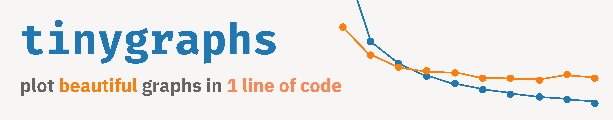

*A minimal library for plotting training progress in Jupyter/COLAB notebooks.*

## Installation

pip install tinyGraphs

## Options

`train_losses`: 
(Required) List of training loss values to plot

`val_losses`: 
(Required) List of validation loss values to plot

`epoch`: 
(Required) Current epoch number for updating the plot

`legend_loc`: 
Location of the legend on the plot (default: "upper right")

`updating_title`: 
Boolean flag to indicate if the title should update with epoch progress (default: True)

`legend`: 
Boolean flag to show/hide the legend (default: True)

`x_label`: 
Label for the x-axis

`y_label`: 
Label for the y-axis

`title`: 
Main title of the plot

`dark_mode`: 
Boolean flag to switch between light and dark themes (default: True)

## Usage

```python

train_losses, val_losses = [], []
epochs = 3

for epoch in range(epochs):
    # Training
    model.train()
    running_train_loss = 0
    for x, y in train_loader:
        x, y = x.to(device), y.to(device)
        optimizer.zero_grad()
        loss = criterion(model(x), y)
        loss.backward()
        optimizer.step()
        running_train_loss += loss.item()
    train_losses.append(running_train_loss / len(train_loader))

    # Validation
    model.eval()
    running_val_loss = 0
    with torch.no_grad():
        for x, y in val_loader:
            x, y = x.to(device), y.to(device)
            loss = criterion(model(x), y)
            running_val_loss += loss.item()
    val_losses.append(running_val_loss / len(val_loader))

    # Plot using tinyGraphs
    plot(train_losses, val_losses, epoch, legend_loc = "upper right", updating_title = False, legend = True, x_label = "x title", y_label = "y title", title = "title", dark_mode = False)

```
## Other Usage Options

```python
    plot(train_losses, val_losses, epoch, legend_loc = "upper right", updating_title = False, legend = True, x_label = "Epoch", y_label = "Loss", title = "Loss Graph", dark_mode = True)
```


```python
    plot(train_losses, val_losses, epoch, color_scheme = 'jet')
```
